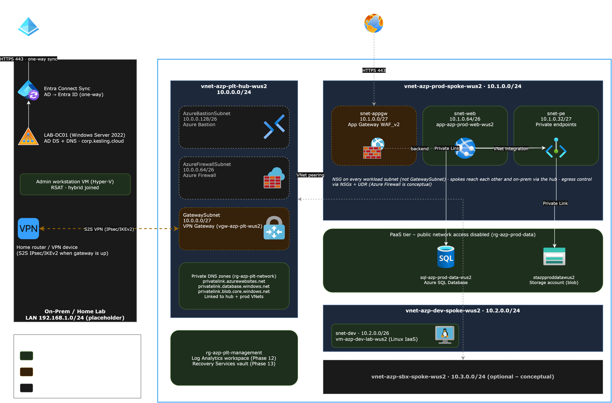

# Azure Hybrid Cloud Portfolio

A production-style Azure environment connected to an on-prem Active Directory lab. I'm building it to practice and demonstrate Azure administration and engineering skills while preparing for the AZ-104 exam. It follows Microsoft's Cloud Adoption Framework and Well-Architected guidance, scaled down to a single trial subscription with cost as a hard constraint.

> **Status: in progress.** The [roadmap](docs/00-roadmap.md) shows what is built, what is next, and what is intentionally conceptual.

## Architecture



Other views: [Subscriptions and governance](diagrams/Subscription_Overview.png) · [On-prem and hybrid identity](diagrams/On-Prem.png)

## What this project demonstrates

| Area | What it covers | Details |
|---|---|---|
| Identity and governance | Entra ID, hybrid identity with Entra Connect, group-based RBAC, break-glass access, management groups, Azure Policy, tagging, budgets | [02](docs/02-governance-identity.md) |
| Networking | Hub-and-spoke VNets, peering, NSGs, site-to-site VPN, private endpoints, private DNS | [03](docs/03-networking.md) |
| Compute and PaaS | App Service, Linux IaaS VM | [04](docs/04-workloads.md) |
| Storage and data | Storage account, Azure SQL Database, private access only | [04](docs/04-workloads.md) |
| Monitoring and recovery | Log Analytics, alerts, backup, update management, Defender for Cloud | [05](docs/05-operations-security.md) |
| Infrastructure as code | Terraform and CI/CD (planned) | Roadmap phase 16 |

## Design principles

- **Security built in.** Private connectivity where practical, least-privilege RBAC, NSGs on every workload subnet, no public access to data services.
- **Cost-aware.** Every resource is either *deployed*, *short-lived* (built, verified, destroyed), or *conceptual* (documented only). See [ADR-002](docs/decisions/ADR-002-cost-tiers.md).
- **Decisions are recorded.** Design choices live in [docs/decisions](docs/decisions/) so the reasoning is auditable.
- **Honest scope.** The trial allows one subscription, so the enterprise subscription layout is shown as a target design, not a deployment.

## Repository layout

```
docs/          strategy, roadmap, design docs, deployment log, ADRs
diagrams/      draw.io sources and PNG exports
runbooks/      troubleshooting and how-to notes
scripts/       PowerShell and Azure CLI
terraform/     infrastructure as code (added in phase 16)
```

## Conventions

Naming: `{resource-type}-{project}-{environment}-{purpose}-{region}`, for example `vnet-azp-plt-hub-wus2`. Tags: Environment, Workload, Project, ManagedBy, CostCenter, Criticality. Full details are in [01-strategy](docs/01-strategy.md).

## Cost approach

Azure free trial credits, budget alerts, and a short-lived deployment pattern for expensive services such as VPN Gateway and Application Gateway. Azure Firewall, Bastion and DNS Private Resolver are documented but not deployed.

## About

Built by TJ Kesling · linkedin.com/in/tj-kesling · Targeting Azure engineer / cloud administrator roles.
